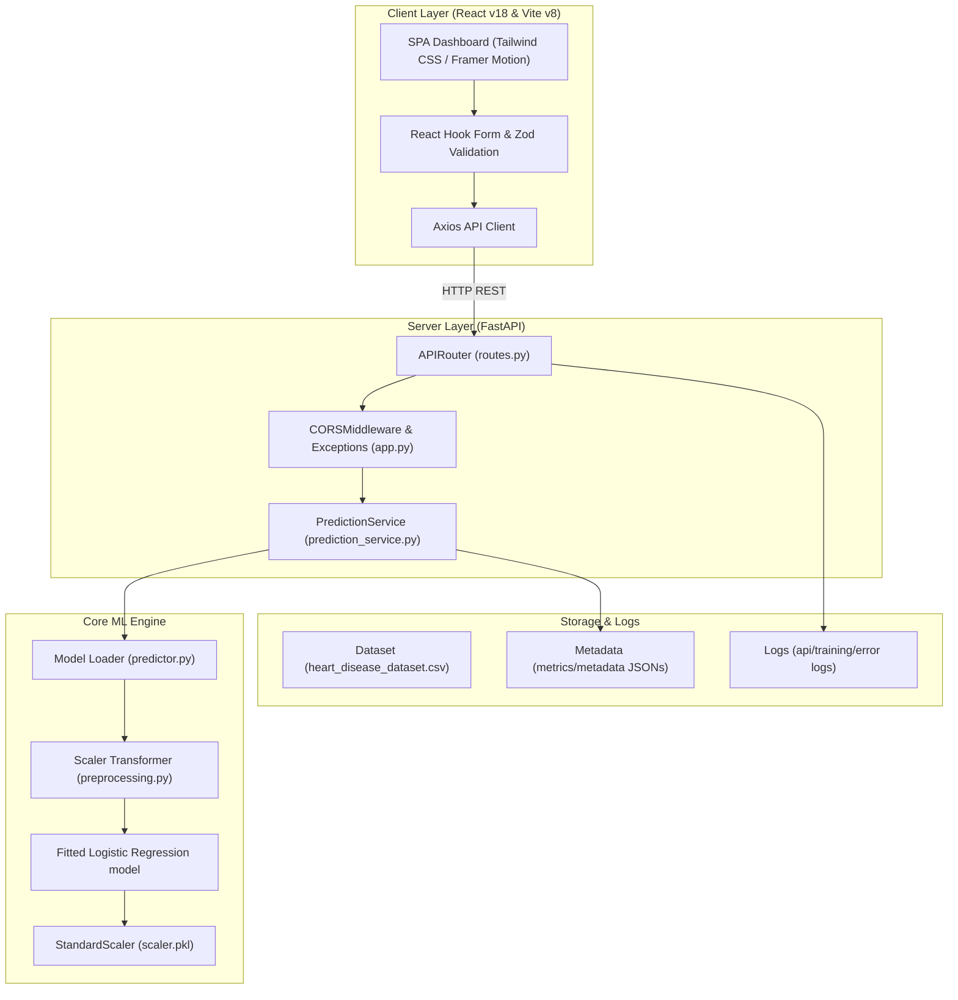

# CardioPulse v1.0 — AI Heart Disease Classification System

[](https://github.com/sumedhwahurwagh1/CardioPulse/actions)
[](#copyright-and-ownership)
[](#project-status)

CardioPulse is a production-grade machine learning platform that evaluates patient clinical metrics to estimate coronary artery disease risk and provide custom medical recommendations. The system features a modular Python ML engine, a high-performance FastAPI backend service, and a premium React TypeScript single-page dashboard.

---

## 🚀 Live Demo & Deployment URLs

- **Frontend Client**: [https://cardio-pulse.vercel.app](https://cardio-pulse.vercel.app)
- **Backend API**: [https://cardiopulse-api.onrender.com](https://cardiopulse-api.onrender.com)
- **API Documentation (Swagger)**: [https://cardiopulse-api.onrender.com/docs](https://cardiopulse-api.onrender.com/docs)
- **GitHub Repository**: [https://github.com/sumedhwahurwagh1/CardioPulse](https://github.com/sumedhwahurwagh1/CardioPulse)

---

## 🧠 Medical Disclaimer

> [!IMPORTANT]
> This application is intended for educational and research purposes only. It does not provide medical diagnosis, treatment guidelines, or patient outcomes, and must not replace consultations with qualified healthcare professionals or certified cardiologists.

---

## 🏗️ Technical Architecture



---

## ✨ System Features

- **Candidate Model Comparison**: Auto-trains and compares five machine learning classifiers (Logistic Regression, Random Forest, Support Vector Machine, KNN, Decision Tree) and deploys the highest-performing instance in production.
- **Dynamic Multi-Step Form**: Wizard-style client diagnostics form (Personal -> Vitals -> Clinical) with real-time Zod validations.
- **SaaS Risk Visualizer**: SVG radial progress bar rendering estimated coronary risk probability.
- **Enhanced Health Telemetry**: Live `/health` route reporting API version, environment name, active model state, and server uptime.
- **Segregated Operational Logging**: Directs log statements to `api.log`, `training.log`, and `error.log`.

---

## 🛠️ Technology Stack

- **Frontend Client**: React 18, TypeScript, Vite 8, Tailwind CSS v3, React Router v6, React Hook Form, Zod, Framer Motion, Lucide Icons.
- **Backend Service**: Python 3.11+, FastAPI, Scikit-Learn, Pandas, NumPy, Joblib, Uvicorn, Pydantic.
- **DevOps & CI/CD**: Docker, Docker Compose, GitHub Actions, Nginx.
- **Hosting Targets**: Vercel (Frontend), Render (Backend API).

---

## 📁 Folder Structure

```text
Heart-Disease-Detection-ML/
│
├── .github/workflows/          # GitHub Actions CI pipeline configs
├── assets/                     # Media placeholders and diagrams
├── dataset/                    # UCI Heart Disease CSV dataset
├── docs/                       # Case studies, deployment, and resume guides
├── logo/                       # Project logo vectors
├── models/                     # Pickled model, scaler, and JSON performance metrics
├── reports/                    # Generated comparison plot figures
├── screenshots/                # Application screen captures
├── backend/                    # Python package and FastAPI API
│   ├── api/                    # API routing, exception managers, and validation schemas
│   ├── ml/                     # ML training configs, preprocessors, and evaluation scripts
│   ├── services/               # Shared logging structures and business logic services
│   ├── train_cli.py            # CLI training automation
│   ├── predict_cli.py          # Interactive command-line predictor
│   └── app.py                  # API server instance
│
├── frontend/                   # React TypeScript frontend Single-Page Application
│   ├── src/                    # Components, routing layouts, and services
│   └── Dockerfile              # Multi-stage frontend Docker configuration
│
├── docker-compose.yml          # Containers orchestration compose configuration
├── render.yaml                 # Render Blueprint configuration
└── README.md                   # Repository documentation
```

---

## 📸 Application Screenshots

| Landing Page | Diagnostic Wizard | Risk Results |
| :---: | :---: | :---: |
| *[landing_page.png](file:///Users/sumedhwahurwagh/Heart-Disease-Detection-ML/screenshots/landing_page.png)* | *[diagnostic_wizard.png](file:///Users/sumedhwahurwagh/Heart-Disease-Detection-ML/screenshots/diagnostic_wizard.png)* | *[risk_results.png](file:///Users/sumedhwahurwagh/Heart-Disease-Detection-ML/screenshots/risk_results.png)* |

*Please check [screenshots/README.md](file:///Users/sumedhwahurwagh/Heart-Disease-Detection-ML/screenshots/README.md) to populate the directory.*

---

## 🚦 Local Installation Guide

### 1. Backend Service Setup

```bash
# Create and activate virtual environment
python3 -m venv .venv
source .venv/bin/activate

# Install dependencies
pip install -r requirements.txt

# Run model training CLI (fits and serializes best candidate model)
PYTHONPATH=. python3 backend/train_cli.py

# Start local FastAPI dev server
PYTHONPATH=. uvicorn backend.app:app --reload
```
API docs will load at [http://127.0.0.1:8000/docs](http://127.0.0.1:8000/docs).

### 2. Frontend Client Setup

```bash
cd frontend
npm install
npm run dev
```
Open [http://localhost:5173](http://localhost:5173) in your browser.

---

## 🐳 Docker Deployment

To spin up the entire application locally using Docker:

```bash
# Build and run containers
docker compose up --build
```
- Frontend serves on [http://localhost:8080](http://localhost:8080).
- Backend API runs on [http://localhost:8000](http://localhost:8000).

---

## 👤 Developer Profile

**Sumedh Sanjay Wahurwagh**
- **Role**: Full Stack Developer & Machine Learning Engineer
- **Institution**: College of Engineering and Technology, Akola
- **Skills**: Python, FastAPI, React, TypeScript, Scikit-learn, Docker, Machine Learning, REST APIs, Tailwind CSS, GitHub Actions, Render, Vercel.

### Professional Links:
- **GitHub**: [https://github.com/sumedhwahurwagh1](https://github.com/sumedhwahurwagh1)
- **LinkedIn**: [https://www.linkedin.com/in/sumedh-wahurwagh-234093307/](https://www.linkedin.com/in/sumedh-wahurwagh-234093307/)
- **Email**: [sumedhwahurwagh1@gmail.com](mailto:sumedhwahurwagh1@gmail.com)

---

## 🤝 Acknowledgements

CardioPulse v1.0 relies on the contributions of the following open-source frameworks and research entities:
- **UCI Machine Learning Repository**: Cleveland Clinic Heart Disease dataset creators.
- **FastAPI / Uvicorn**: High-performance asynchronous API foundation.
- **Scikit-Learn / Pandas**: Core scientific data fitting structures.
- **React / Tailwind CSS / Framer Motion**: Interactive frontend framework and layout styles.
- **Docker / Render / Vercel**: Deployment platforms and containerization tools.

*Datasets and frameworks remain the property of their respective owners.*

---

## 🔒 Copyright and Ownership

**Copyright © 2026 Sumedh Sanjay Wahurwagh. All Rights Reserved.**

This software, source code, UI, documentation, and system architecture are the intellectual property of Sumedh Sanjay Wahurwagh. Unauthorized commercial redistribution or code rebranding without explicit written permission is strictly prohibited.
